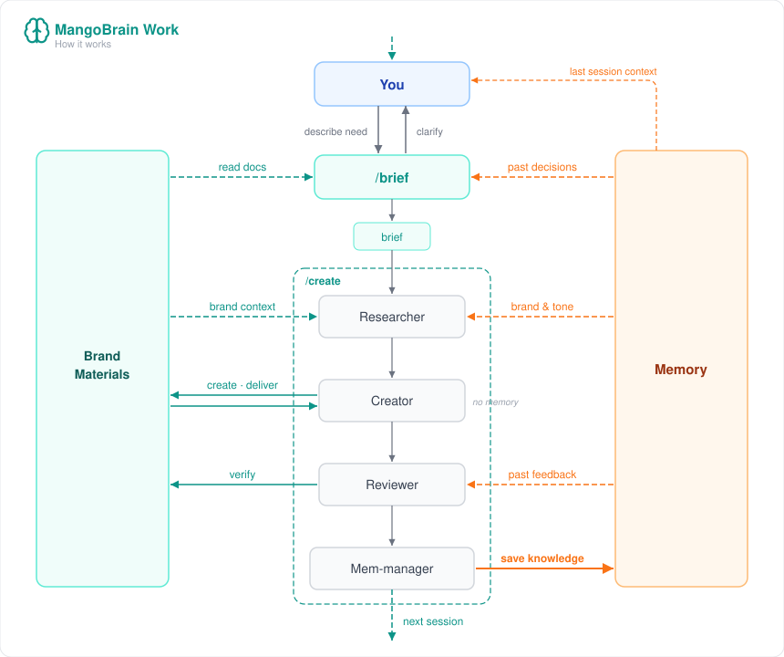

<p align="center">
  
</p>

<h1 align="center">MangoBrain Work</h1>

<p align="center">
  <strong>The work layer for Claude</strong>
</p>

<p align="center">
  <em>Claude gets smarter about your project the longer you use it.</em><br/>
  <sub>Brief with <code>/brief</code>. Create with <code>/create</code>. Knowledge saves itself.</sub>
</p>

<p align="center">
  
  
  
  
</p>

<p align="center">
  <a href="https://github.com/Federico-Anastasi/mangobrain">MangoBrain</a> · <a href="#getting-started">Install</a> · <a href="https://github.com/Federico-Anastasi/mangobrain-work">GitHub</a>
</p>

---

**Session 1:** You tell Claude your brand tone is "premium but accessible."
**Session 12:** Claude writes an Instagram caption. MangoBrain recalls the tone, the audience persona, the fact that short copy performs better. The caption nails it first try.

**No manual reminders. No copy-pasting brand guides.** The mem-manager captures decisions at session close. The researcher recalls them next time.

---

## Why this exists

MangoBrain was built for developers — persistent memory for code projects. But the same problem exists in every non-code workflow: marketing, strategy, content, business planning. Every new Claude session starts from scratch.

You explain your brand tone again. You re-describe your audience. You re-share your content guidelines. Every. Single. Time.

MangoBrain Work solves this. It's a plugin that gives Claude a persistent, associative memory for your project's business and creative side. Plan with `/brief`, produce with `/create`, and knowledge accumulates automatically — tone preferences, audience insights, what worked, what didn't.

After 50+ sessions, Claude knows your project better than a new hire.

---

## How it works

<p align="center">
  
</p>

| | What happens | Materials | Memory |
|---|---|---|---|
| **`/brief`** | You describe what you need. Claude reads docs, recalls past decisions, and produces a structured brief. | reads | reads |
| **Researcher** | Gathers brand context, audience insights, channel rules, and past content performance from memory. | reads | reads |
| **Creator** | Produces the deliverable — copy, strategy, presentations, video. 100% focused on creation. | creates | — |
| **Reviewer** | Checks brand consistency, brief compliance, quality. Recalls past feedback to avoid repeated mistakes. | reads | reads |
| **Mem-manager** | Captures decisions, user feedback, content patterns. Updates rules when needed. Zero effort from you. | updates | **writes** |
| **Next session** | `/brief` starts with everything the last cycle learned. The loop repeats — each session smarter. | | reads |

---

## What you can build

MangoBrain Work is designed for the work that surrounds building a product:

| Area | What Claude produces | Tools |
|------|---------------------|-------|
| **Marketing strategy** | Go-to-market plans, positioning, competitor analysis | Docs |
| **Social content** | Instagram posts, carousels, Reels scripts, TikTok, LinkedIn | Canva, text |
| **Video & motion** | Animated intros, explainer videos, Reel visuals | Remotion |
| **Business planning** | Business plan, revenue model, budget, financial projections | .xlsx, docs |
| **Presentations** | Pitch decks, strategy slides, investor materials | .pptx |
| **Brand identity** | Guidelines, visual system, naming, positioning statement | Docs, Canva |
| **Content planning** | Editorial calendars, campaign plans, content strategy | .xlsx, docs |
| **Copywriting** | Landing pages, email campaigns, newsletters, ad copy | Text |
| **Research** | Market analysis, competitor audit, trend reports | Web, docs |

---

## Getting started

### Prerequisites

MangoBrain Work is a **plugin** — it provides the workflow (skills + agents). The memory engine runs separately.

You need:
1. **Claude Desktop** (Pro subscription)
2. **MangoBrain MCP server** running — [install guide](https://github.com/Federico-Anastasi/mangobrain)

### 1. Install MangoBrain (memory engine)

```bash
pip install mango-brain
```

Configure in Claude Desktop: Settings → Developer → Edit Config:

```json
{
  "mcpServers": {
    "mangobrain": {
      "command": "mangobrain",
      "args": ["serve"],
      "env": { "PYTHONIOENCODING": "utf-8" }
    }
  }
}
```

Restart Claude Desktop. Verify MangoBrain appears in Connectors.

### 2. Install the plugin

In Claude Desktop: Settings → Plugins → Add marketplace:

```
Federico-Anastasi/mangobrain-work
```

Or load locally: Settings → Plugins → Load local plugin → select this folder.

### 3. Initialize your project

Start a new chat and run:

```
/brain-init-work
```

The init adapts to what you have:
- **Existing MangoBrain Code project?** → pulls product info from code memory (translated to non-technical language)
- **Documents?** → scans brand guidelines, plans, presentations
- **Live website?** → browses and extracts visual identity, copy, tone
- **Nothing?** → guided conversation to build everything from scratch

The init generates `CLAUDE.md`, `.claude/rules/` files, and populates MangoBrain memory. Takes 15-30 minutes. You can do it across multiple sessions.

---

## Skills

### Workflow

| Skill | Purpose | When |
|-------|---------|------|
| `/brief` | Intake with memory context → produces structured brief | Starting new work |
| `/create` | Researcher → Creator → Reviewer → Mem-manager | Producing deliverables |
| `/brain-init-work` | Adaptive project initialization | First time setup |
| `/memorize-work` | Manual session sync + rules update | Free sessions outside /create |

### Maintenance

| Skill | Purpose | When |
|-------|---------|------|
| `/elaborate-work` | Consolidate graph, abstract feedback patterns, resolve duplicates | Weekly |
| `/health-check-work` | Diagnose gaps across project areas, prescribe fixes | Monthly |
| `/smoke-test-work` | Test retrieval quality with diverse queries | After init or elaboration |

---

## Agents

| Agent | Role | Memory | Materials |
|-------|------|--------|-----------|
| **Researcher** | Gathers context — memory, docs, web, cross-project | reads | reads |
| **Creator** | Produces deliverables — copy, docs, .pptx, .xlsx, video | — | creates |
| **Reviewer** | Quality check — brand, brief, history, feedback patterns | reads | reads |
| **Mem-manager** | Persists knowledge, updates rules when decisions change them | **writes** | **updates** |

---

## Rules (auto-generated)

The init generates `.claude/rules/` files that Claude loads every session. These are the project's DNA — they evolve through work and decisions.

| Rule | What it contains |
|------|-----------------|
| `product.md` | What the product does, value proposition, differentiators |
| `brand.md` | Visual identity, personality, positioning, values |
| `tone.md` | Voice per context, DO/DON'T, language rules |
| `audience.md` | Personas, pain points, customer journey, language |
| `channels.md` | Active channels, formats, frequencies, tool stack |
| `strategy.md` | Objectives, KPI, competitors, budget, strategic decisions |

Rules are updated automatically by the mem-manager when session decisions warrant it, and manually during free sessions.

---

## What gets remembered

MangoBrain Work captures three types of knowledge:

| Type | What it stores | Decay | Example |
|------|---------------|-------|---------|
| **Semantic** | Brand rules, audience facts, market insights | Slow | "Brand tone: premium but accessible. Never elitist, never cheap." |
| **Episodic** | Decisions, campaigns, feedback events | Fast | "User rejected formal tone in stories. Preferred casual, direct phrasing." |
| **Procedural** | Content rules, workflows, format specs | Very slow | "Instagram carousels: 3-5 slides, bold title on slide 1, CTA on last slide." |

Over time, episodic feedback consolidates into semantic and procedural rules through [elaboration](https://github.com/Federico-Anastasi/mangobrain#skills--maintenance).

---

## Works with

MangoBrain Work integrates with Claude Desktop's connectors and tools:

| Tool | What it does |
|------|-------------|
| **Canva** | Social post graphics, carousels, stories, visual brand content |
| **Google Drive** | Shared documents, editorial plans, brand materials |
| **Remotion** | Video and motion graphics — Reels, intros, animated content |
| **Chrome/Web** | Competitor research, site analysis, trend scouting |
| **Native .pptx** | Presentations and pitch decks (Claude creates these directly) |
| **Native .xlsx** | Budgets, calendars, tracking sheets (Claude creates these directly) |

All connectors are **optional**. MangoBrain Work works with text output alone — connectors enhance the output quality.

---

## Cross-project memory

If your project has a MangoBrain Code counterpart (the dev side), the Researcher can pull product information from it. Technical details are automatically translated to non-technical language.

```
Code memory:  "Booking uses instant confirmation without owner approval via WebSocket"
Work sees:    "Instant booking — users confirm immediately, no waiting for approval"
```

The work side **reads** from code memory but **writes** only to its own project. Your code memories stay untouched.

---

## Project structure

```
mangobrain-work/
  plugin.json                        # Plugin manifest
  skills/
    brief/SKILL.md                   # Intake with memory
    create/SKILL.md                  # Production orchestrator
    brain-init-work/SKILL.md         # Adaptive project initialization
    memorize-work/SKILL.md           # Session sync + rules update
    elaborate-work/SKILL.md          # Weekly memory consolidation
    health-check-work/SKILL.md       # Monthly health diagnosis
    smoke-test-work/SKILL.md         # Retrieval quality testing
  agents/
    researcher.md                    # Context gatherer
    creator.md                       # Content producer
    reviewer.md                      # Quality checker
    mem-manager.md                   # Knowledge persister + rules updater
  rules/
    mangobrain-remember-work.md      # Query strategy for work projects
    mangobrain-workflow-work.md      # Workflow integration guide
  prompts/
    init-work.md                     # Detailed init extraction guide
    memory-definition.md             # Canonical memory quality standard
  templates/
    CLAUDE.md                        # Project instructions template
    rules/
      product.md                     # Product template
      brand.md                       # Brand template
      tone.md                        # Tone template
      audience.md                    # Audience template
      channels.md                    # Channels template
      strategy.md                    # Strategy template
  assets/
    workflow.svg                     # Flow diagram
    logo.svg                         # Logo
```

---

## Requirements

- **Claude Desktop** Pro subscription
- **MangoBrain** MCP server ([install](https://github.com/Federico-Anastasi/mangobrain))
- **Python** 3.11+ (for MangoBrain server)
- **GPU** optional — improves memory retrieval quality

---

<p align="center">
  Built by <a href="https://github.com/Federico-Anastasi">Federico Anastasi</a>
  <br/>
  <sub>Because your AI partner shouldn't forget your brand.</sub>
</p>
